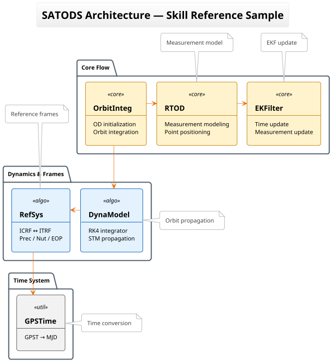

```plantuml
@startuml skill_golden_sample
!theme aws-orange

' ================= Global style =================
skinparam componentStyle rectangle
skinparam defaultFontSize 11
skinparam defaultFontColor #000000
skinparam componentFontColor #000000
skinparam linetype ortho
skinparam ArrowThickness 0.8
skinparam LineThickness 0.8
skinparam ranksep 28
skinparam nodesep 20
skinparam shadowing false
skinparam DefaultTextAlignment left

skinparam note {
  BackgroundColor #FFFFFF
  BorderColor #BBBBBB
  FontColor #444444
}

' ================= Stereotype colors =================
skinparam componentBackgroundColor<<core>> #FFF3CD
skinparam componentBorderColor<<core>>     #C88719
skinparam componentBackgroundColor<<algo>> #E3F2FD
skinparam componentBorderColor<<algo>>     #1565C0
skinparam componentBackgroundColor<<util>> #F2F2F2
skinparam componentBorderColor<<util>>     #616161

top to bottom direction
title SATODS Architecture — Skill Reference Sample

' ================= Core workflow =================
package "Core Flow" {
  component OI <<core>> [
  <size:14><b>OrbitInteg</b></size>
  ----
  OD initialization
  Orbit integration
  ]

  component RTOD <<core>> [
  <size:14><b>RTOD</b></size>
  ----
  Measurement modeling
  Point positioning
  ]

  component EKF <<core>> [
  <size:14><b>EKFilter</b></size>
  ----
  Time update
  Measurement update
  ]
}

' ================= Algorithm layer =================
package "Dynamics & Frames" {
  component Dyna <<algo>> [
  <size:14><b>DynaModel</b></size>
  ----
  RK4 integrator
  STM propagation
  ]

  component Ref <<algo>> [
  <size:14><b>RefSys</b></size>
  ----
  ICRF ↔ ITRF
  Prec / Nut / EOP
  ]
}

' ================= Utility =================
package "Time System" {
  component GPS <<util>> [
  <size:14><b>GPSTime</b></size>
  ----
  GPST → MJD
  ]
}

' ================= Main flow (clean, no labels) =================
OI   -right-> RTOD
RTOD -right-> EKF

OI   -down-> Dyna
Dyna -right-> Ref
Ref  -down-> GPS

' ================= Light semantic annotations (floating) =================
note top of RTOD
Measurement model
end note

note top of EKF
EKF update
end note

note left of Dyna
Orbit propagation
end note

note top of Ref
Reference frames
end note

note right of GPS
Time conversion
end note

' ================= Alignment helpers =================
OI   -[hidden]down-> RTOD
RTOD -[hidden]down-> EKF
Dyna -[hidden]down-> Ref
Ref  -[hidden]down-> GPS

@enduml
```

